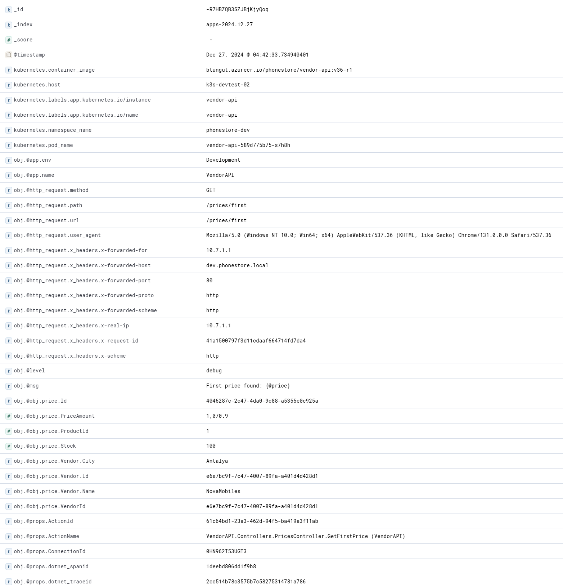

[](https://artifacthub.io/packages/helm/btungut/fluentd-kube-elastic)
[](https://github.com/btungut/fluentd-kube-elastic/releases)
[](https://github.com/btungut/fluentd-kube-elastic/blob/master/LICENSE)

# Fluentd Kube Elastic

Regardless of whether your container logs are plain-text or **json**! This fluentd implementation collects, parses, and sends all types of log entries to **Elasticsearch**.


## Prerequisites
- Helm
- Elasticsearch >8.x

## Installing the Chart


1. First you need to add repository _(if you haven't done yet before)_
```bash
helm repo add btungut https://btungut.github.io
```

2. Helm install / upgrade command

```bash
helm upgrade -i {RELEASE-NAME} btungut/fluentd-kube-elastic \
  --set conf.elasticsearch.host={YOUR-HOST} \
  --set conf.elasticsearch.auth.enabled=true \
  --set conf.elasticsearch.auth.username={YOUR-USER} \
  --set conf.elasticsearch.auth.password={YOUR-PASSWORD} \
  --namespace {YOUR-NS}
```


## Uninstalling the Chart

Run the following snippet to uninstall the release:
```bash
helm delete {RELEASE-NAME}
```

---

## Parameters

### Elasticsearch authentication parameters

TBD!

Regarding other options and their default values, please refer to [`values.yaml`](./chart/values.yaml)

---

## Other Features


### Exclude logs by container name and namespace
It is possible to exclude specific containers by pod name and namespace. Please refer to `conf.ignoredContainersAndNamespaces` in `values.yaml`.
TBD: yaml example

### Exclude logs by words contained in log entry
It is possible to exclude specific logs entries by words. Please refer to `conf.ignoredWords` in `values.yaml`.
TBD: yaml example


---

## See how it works

### Log entry from stdout

```json
{"@timestamp":"2024-12-27T01:42:33.7266952Z","@level":"debug","@src":"VendorAPI.Controllers.PricesController","@trx":"41a1500797f3d11cdaaf664714fd7da4","@msg":"First price found: {@price}","@obj":{"price":{"Id":"4046287c-2c47-4da0-9c88-a5355e0c925a","ProductId":1,"VendorId":"e6e7bc9f-7c47-4007-89fa-a401d4d428d1","PriceAmount":1070.9,"Stock":100,"Vendor":{"Id":"e6e7bc9f-7c47-4007-89fa-a401d4d428d1","Name":"NovaMobiles","City":"Antalya"}}},"@props":{"ActionId":"61c64bd1-23a3-462d-94f5-ba419a3f11ab","ActionName":"VendorAPI.Controllers.PricesController.GetFirstPrice (VendorAPI)","RequestId":"0HN962I53UGT3:0000000B","RequestPath":"/prices/first","ConnectionId":"0HN962I53UGT3","dotnet_spanid":"1deebd806dd1f9b8","dotnet_traceid":"2cc514b78c3575b7c58275314781a786"},"@http_request":{"method":"GET","url":"/prices/first","path":"/prices/first","x_headers":{"x-request-id":"41a1500797f3d11cdaaf664714fd7da4","x-real-ip":"10.7.1.1","x-forwarded-for":"10.7.1.1","x-forwarded-host":"dev.phonestore.local","x-forwarded-port":"80","x-forwarded-proto":"http","x-forwarded-scheme":"http","x-scheme":"http"},"user_agent":"Mozilla/5.0 (Windows NT 10.0; Win64; x64) AppleWebKit/537.36 (KHTML, like Gecko) Chrome/131.0.0.0 Safari/537.36"},"@app":{"name":"VendorAPI","env":"Development"}}
```

### Parsed log entry screenshot




### Parsed log entry from Kibana / Elasticsearch

```json
{
  "_index": "apps-2024.12.27",
  "_id": "-R7HBZQB3SZJBjKjyQoq",
  "_version": 1,
  "_score": 0,
  "_ignored": [
    "obj.@http_request.user_agent.keyword"
  ],
  "_source": {
    "stream": "stdout",
    "obj": {
      "@timestamp": "2024-12-27T01:42:33.7266952Z",
      "@level": "debug",
      "@src": "VendorAPI.Controllers.PricesController",
      "@trx": "41a1500797f3d11cdaaf664714fd7da4",
      "@msg": "First price found: {@price}",
      "@obj": {
        "price": {
          "Id": "4046287c-2c47-4da0-9c88-a5355e0c925a",
          "ProductId": 1,
          "VendorId": "e6e7bc9f-7c47-4007-89fa-a401d4d428d1",
          "PriceAmount": 1070.9,
          "Stock": 100,
          "Vendor": {
            "Id": "e6e7bc9f-7c47-4007-89fa-a401d4d428d1",
            "Name": "NovaMobiles",
            "City": "Antalya"
          }
        }
      },
      "@props": {
        "ActionId": "61c64bd1-23a3-462d-94f5-ba419a3f11ab",
        "ActionName": "VendorAPI.Controllers.PricesController.GetFirstPrice (VendorAPI)",
        "RequestId": "0HN962I53UGT3:0000000B",
        "RequestPath": "/prices/first",
        "ConnectionId": "0HN962I53UGT3",
        "dotnet_spanid": "1deebd806dd1f9b8",
        "dotnet_traceid": "2cc514b78c3575b7c58275314781a786"
      },
      "@http_request": {
        "method": "GET",
        "url": "/prices/first",
        "path": "/prices/first",
        "x_headers": {
          "x-request-id": "41a1500797f3d11cdaaf664714fd7da4",
          "x-real-ip": "10.7.1.1",
          "x-forwarded-for": "10.7.1.1",
          "x-forwarded-host": "dev.phonestore.local",
          "x-forwarded-port": "80",
          "x-forwarded-proto": "http",
          "x-forwarded-scheme": "http",
          "x-scheme": "http"
        },
        "user_agent": "Mozilla/5.0 (Windows NT 10.0; Win64; x64) AppleWebKit/537.36 (KHTML, like Gecko) Chrome/131.0.0.0 Safari/537.36"
      },
      "@app": {
        "name": "VendorAPI",
        "env": "Development"
      }
    },
    "kubernetes": {
      "namespace_name": "phonestore-dev",
      "pod_name": "vendor-api-589d775b75-s7h8h",
      "container_image": "btungut.azurecr.io/phonestore/vendor-api:v36-r1",
      "host": "k3s-devtest-02",
      "labels": {
        "app.kubernetes.io/instance": "vendor-api",
        "app.kubernetes.io/name": "vendor-api"
      }
    },
    "@timestamp": "2024-12-27T01:42:33.734940401Z"
  }
}
```
