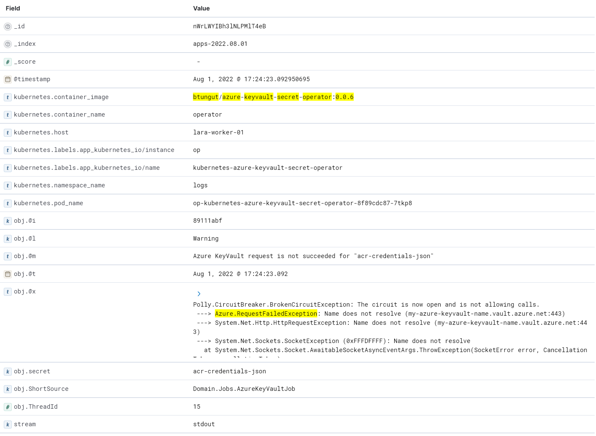

[](https://artifacthub.io/packages/helm/btungut/fluentd-kube-elastic)
[](https://github.com/btungut/fluentd-kube-elastic/releases/tag/v1.15.3)
[](https://github.com/btungut/fluentd-kube-elastic/blob/master/LICENSE)

# Fluentd Kube Elastic

Regardless of whether your container logs are plain-text or **json**! This fluentd implementation collects, parses, and sends all types of log entries to **Elasticsearch**.

---

## Json log message support
Especially for the logs which is being produced by distributed apps / microservices could be important more than ever.
This fluentd implementation has ability to parse **JSON serialized log messages** and to index in Elasticsearch.

An example from application:

```csharp
internal class AppConfiguration
{
    public LogEventLevel LogLevel { get; set; } = LogEventLevel.Information;
    public bool EnableJsonLogging { get; set; } = false;

    public int WorkerCount { get; private set; } = 1;
    public TimeSpan ReconciliationFrequency { get; set; } = TimeSpan.FromSeconds(30);
}
```
```csharp
_logger.Information("Configuration is {@config}", AppConfiguration);
```

This log entry will be exported by Kubernetes like below:
```json
...
2022-07-17T12:56:31.736626057Z stdout F {"@t":"2022-07-30T09:16:37.360159003Z","@m":"Configuration is AppConfiguration { LogLevel: Information, EnableJsonLogging: True, WorkerCount: 1, ReconciliationFrequency: 00:00:30 }","@i":"77f2b591","config":{"LogLevel":"Information","EnableJsonLogging":true,"WorkerCount":1,"ReconciliationFrequency":"00:00:30","$type":"AppConfiguration"},"ShortSource":"Program","ThreadId":1}
...
```

**Only thing your application should do** is writing the log messages as json serialized, like the entry above.

This log entry will be parsed Elasticsearch exactly the same way how it was created:
```json
{
  "_index": "apps-2022.07.30",
  "_id": "aF9EVIIBh3lNLPMlh6zB",
  "_version": 1,
  "_score": 0,
  "_source": {
    "stream": "stdout",
    "obj": {
      "@t": "2022-07-30T09:16:37.360159003Z",
      "@m": "Configuration is AppConfiguration { LogLevel: Information, EnableJsonLogging: True, WorkerCount: 1, ReconciliationFrequency: 00:00:30 }",
      "@i": "77f2b591",
      "config": {
        "LogLevel": "Information",
        "EnableJsonLogging": true,
        "WorkerCount": 1,
        "ReconciliationFrequency": "00:00:30",
        "$type": "AppConfiguration"
      },
      "ShortSource": "Program",
      "ThreadId": 1
    },
    "kubernetes": {
      "container_name": "operator",
      "namespace_name": "logs",
      "pod_name": "op-kubernetes-azure-keyvault-secret-operator-8f89cdc87-6l8vm",
      "container_image": "btungut/azure-keyvault-secret-operator:0.0.6",
      "host": "lara-worker-03",
      "labels": {
        "app_kubernetes_io/instance": "op",
        "app_kubernetes_io/name": "kubernetes-azure-keyvault-secret-operator"
      }
    },
    "@timestamp": "2022-07-30T09:16:37.360159003Z"
  }
}
```

All the fields in the json object are parsed and queryable with terms. This helm chart imports [an index template](./chart/files/index-template.json) which is designed for general purposes.  

---

## Prerequisites
- Helm
- Elasticsearch >8.x

## Installing the Chart


1. First you need to add repository _(if you haven't done yet before)_
```bash
helm repo add btungut https://btungut.github.io
```

2. Install the helm chart with required parameters
  - With bash: 
```bash
helm install {RELEASE-NAME} btungut/fluentd-kube-elastic \
  --set conf.elasticsearch.host={YOUR-HOST} \
  --set conf.elasticsearch.password={YOUR-PASSWORD} \
  --namespace {YOUR-NS}
```

  - With powershell: 
```powershell
helm install {RELEASE-NAME} btungut/fluentd-kube-elastic `
  --set conf.elasticsearch.host={YOUR-HOST} `
  --set conf.elasticsearch.password={YOUR-PASSWORD} `
  --namespace {YOUR-NS}
```

## Uninstalling the Chart

Run the following snippet to uninstall the release:
```bash
helm delete {RELEASE-NAME}
```

---

## Parameters

### Elasticsearch authentication parameters

> :warning: Helm chart provides two option for authentication. Please use only one them.

| Name                | Description                                           | Value                 |
| ------------------- | ----------------------------------------------------- | --------------------- |
| `conf.elasticsearch.password` | (1st Option) Password for elasticsearch                     | `""`   |
| `conf.elasticsearch.passwordSecret` | (2nd Option) Already existing secret name that stores password for elasticsearch                     | `""`   |
| `conf.elasticsearch.user` | User for elasticsearch | `"elastic"`   |


### Elasticsearch other parameters


| Name                | Description                                           | Value                 |
| ------------------- | ----------------------------------------------------- | --------------------- |
| `conf.elasticsearch.host` | Hostname or IP for elasticsearch API | `""`   |
| `conf.elasticsearch.port` | Port for elasticsearch API | `"9200"`   |
| `conf.elasticsearch.scheme` | Scheme for elasticsearch API | `"http"`   |
| `conf.elasticsearch.tlsSecret` | Secret name for TLS that contains 'ca.crt', 'tls.crt', and 'tls.key'. `scheme` must be `https` in order to enable TLS communication | `""`   |
| `conf.elasticsearch.importIndexTemplate` | Whether import index template for 'apps-' indexes | `true`   |


Regarding other options and their default values, please refer to [`values.yaml`](./chart/values.yaml)

---

## Other Features


### Excluding the containers
It is possible to exclude specific containers by pod name and namespace. Please refer to `conf.exclude` in `values.yaml`.

```yaml
conf:
  ...
  ...
  exclude:
    - "/var/log/containers/*fluentd*"
    - "/var/log/containers/*kube-system*"
    - "/var/log/containers/*cattle*"
...
```

By default, the helm chart excludes the container logs which is defined above snippet.

### Multiline parsing
This capability is essential for detecting logs with new lines, such as error logs with stack traces.
Out of the box, neither Kubernetes nor Fluentd is not able to identify which log record has one or more than one lines.

This helm chart and fluentd implementation is configured to identify multi line logs with specific regex pattern. Please refer to `conf.multilinePattern` :

```yaml
conf:
  ...
  ...
  multilinePattern: ^((\d{4})-(\d{2})-(\d{2})(T| )(\d{2})\:(\d{2})\:(\d{2}))|(\[(?i)(trace|tra|trc|debug|dbg|deb|information|info|inf|warning|warn|wrn|error|err|fatal|fat|ftl|critical|crit|crt|emergency|emerg|emr|emg|emrg)\])
...
```

The regex pattern defined above tries to match **two pattern** with **OR** (at least one) manner.

A log record should:
1. Start with date time **OR**
   - `yyyy-MM-dd hh:mm:ss` **OR**
   - `yyyy-MM-ddThh:mm:ss` (ISO8601 without milliseconds)
2. Include log severity with square brackets
   - `.......... [INFO] ...........`
   - `.......... [Inf] ............`
   - `.......... [information] ....`


### Parsing both of plain and json logs
The container logs may be written as **plain text** with a specified pattern or **json** depending on the Kubernetes version you're running.
These two log structures can both be parsed by this fluentd implementation.

Example for plain text with multiline:
```
2022-07-17T12:58:58.133325744Z stdout F 2022-07-17T12:58:57.8374820+00:00 [ERR] [11] (Domain.AzureKeyVaultClient) : GetSecretAsync : Azure response is not succeeded for amqp
2022-07-17T12:58:58.133360044Z stdout F Azure.RequestFailedException: Name does not resolve (my-azure-keyvault-name.vault.azure.net:443)
2022-07-17T12:58:58.133367244Z stdout F  ---> System.Net.Http.HttpRequestException: Name does not resolve (my-azure-keyvault-name.vault.azure.net:443)
2022-07-17T12:58:58.133374244Z stdout F  ---> System.Net.Sockets.SocketException (0xFFFDFFFF): Name does not resolve
2022-07-17T12:58:58.133380344Z stdout F    at System.Net.Sockets.Socket.AwaitableSocketAsyncEventArgs.ThrowException(SocketError error, CancellationToken cancellationToken)
```

Example for json with multiline:
```json
{"log":"2022-07-17T12:45:40.0462090+00:00 [INF] [1] (Program) : Process is started\n","stream":"stdout","time":"2022-07-17T12:45:40.242996175Z"}
{"log":"2022-07-17T12:45:52.7454373+00:00 [ERR] [5] (Domain.AzureKeyVaultClient) : GetSecretAsync : Azure response is not succeeded for amqp\n","stream":"stdout","time":"2022-07-17T12:45:52.850729939Z"}
{"log":"Azure.RequestFailedException: Name does not resolve (my-azure-keyvault-name.vault.azure.net:443)\n","stream":"stdout","time":"2022-07-17T12:45:52.850745339Z"}
{"log":" ---\u003e System.Net.Http.HttpRequestException: Name does not resolve (my-azure-keyvault-name.vault.azure.net:443)\n","stream":"stdout","time":"2022-07-17T12:45:52.850747839Z"}
{"log":" ---\u003e System.Net.Sockets.SocketException (0xFFFDFFFF): Name does not resolve\n","stream":"stdout","time":"2022-07-17T12:45:52.850749939Z"}
{"log":"   at System.Net.Sockets.Socket.AwaitableSocketAsyncEventArgs.ThrowException(SocketError error, CancellationToken cancellationToken)\n","stream":"stdout","time":"2022-07-17T12:45:52.850751739Z"}
```


